# XB Taskera — loyihaning to'liq flowchart kodi

Barcha diagrammalar **Lucidchart Mermaid** dialektida yozilgan:
`graph TD` / `graph LR`, tirnoqsiz label, `-- matn -->` ko'rinishidagi bog'lanish.

**Qanday ishlatiladi:** Lucidchart → Insert → Diagram as Code → Mermaid →
kerakli blokdagi kodni ```` ```mermaid ```` va ```` ``` ```` belgilarisiz nusxalab qo'ying.
Har bir diagramma mustaqil, bittalab import qilinadi.

Diagrammalar kod bazasidan o'qib chiqilgan haqiqiy oqimni aks ettiradi:
`backend/routes/api.php`, `backend/app/Modules/**`, `backend/app/Services/**`,
`frontend/src/App.tsx`, `frontend/src/shared/**`.

## Mundarija

1. [Tizim konteksti](#1-tizim-konteksti)
2. [Backend qatlamlari](#2-backend-qatlamlari)
3. [HTTP so'rov konveyeri](#3-http-sorov-konveyeri)
4. [Frontend yuklanish va marshrutlash](#4-frontend-yuklanish-va-marshrutlash)
5. [Frontend API qatlami](#5-frontend-api-qatlami)
6. [Login oqimi](#6-login-oqimi)
7. [Pochta AD hisobi ochish oqimi](#7-pochta-ad-hisobi-ochish-oqimi)
8. [Zayavka yaratish oqimi](#8-zayavka-yaratish-oqimi)
9. [Zayavka hayot sikli](#9-zayavka-hayot-sikli)
10. [Zayavkani biriktirish oqimi](#10-zayavkani-biriktirish-oqimi)
11. [Holatni o'zgartirish oqimi](#11-holatni-ozgartirish-oqimi)
12. [SLA hisoblash oqimi](#12-sla-hisoblash-oqimi)
13. [Izoh va biriktirma oqimi](#13-izoh-va-biriktirma-oqimi)
14. [Domen hodisalari va tinglovchilar](#14-domen-hodisalari-va-tinglovchilar)
15. [Telegram webhook oqimi](#15-telegram-webhook-oqimi)
16. [Telegram bot suhbat mashinasi](#16-telegram-bot-suhbat-mashinasi)
17. [Bildirishnoma oqimi](#17-bildirishnoma-oqimi)
18. [Cisco Finesse qo'ng'iroq oqimi](#18-cisco-finesse-qongiroq-oqimi)
19. [RBAC huquq tekshiruvi](#19-rbac-huquq-tekshiruvi)
20. [Ma'lumotlar bazasi bloklari](#20-malumotlar-bazasi-bloklari)
21. [Umumiy end-to-end oqim](#21-umumiy-end-to-end-oqim)

---

## 1. Tizim konteksti

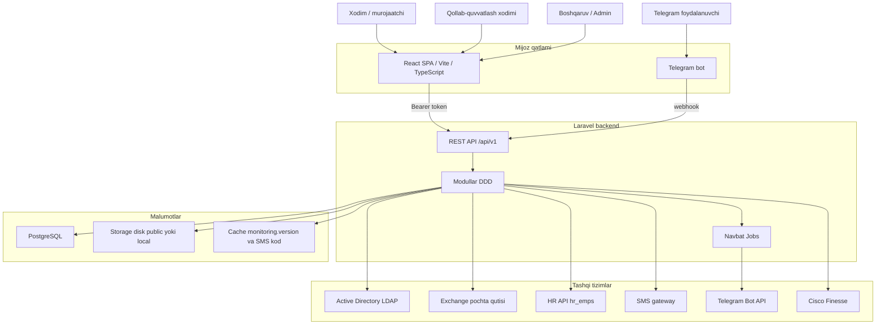

---

## 2. Backend qatlamlari

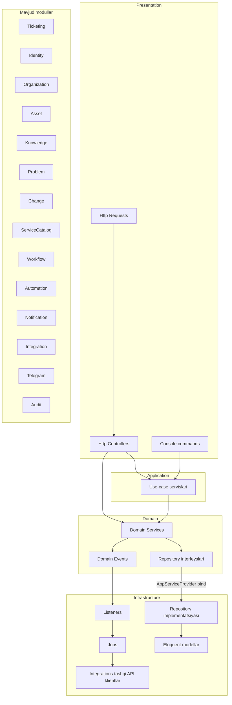

---

## 3. HTTP so'rov konveyeri

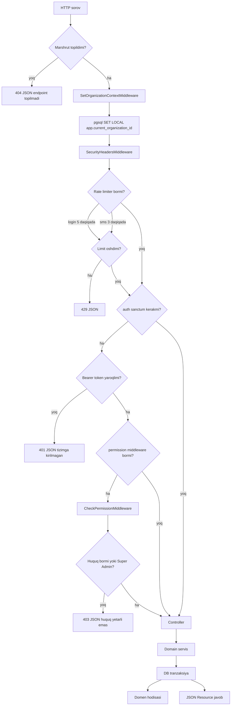

---

## 4. Frontend yuklanish va marshrutlash

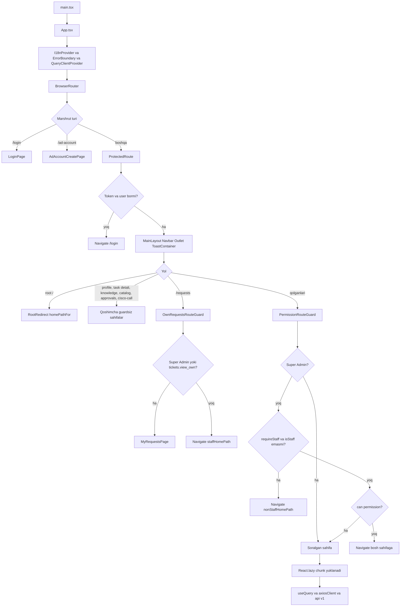

### Himoyalangan sahifalar va huquqlar

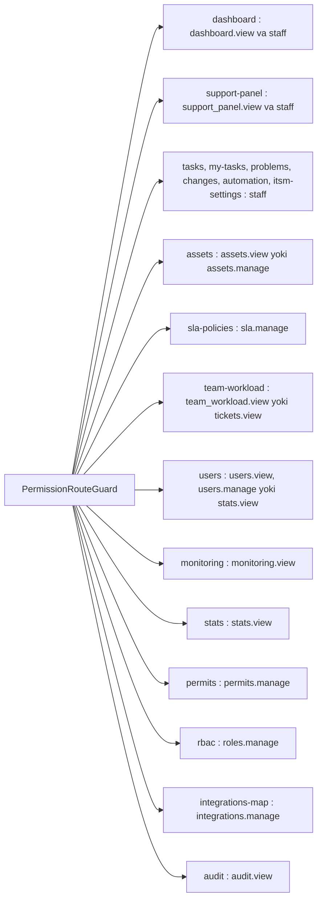

---

## 5. Frontend API qatlami

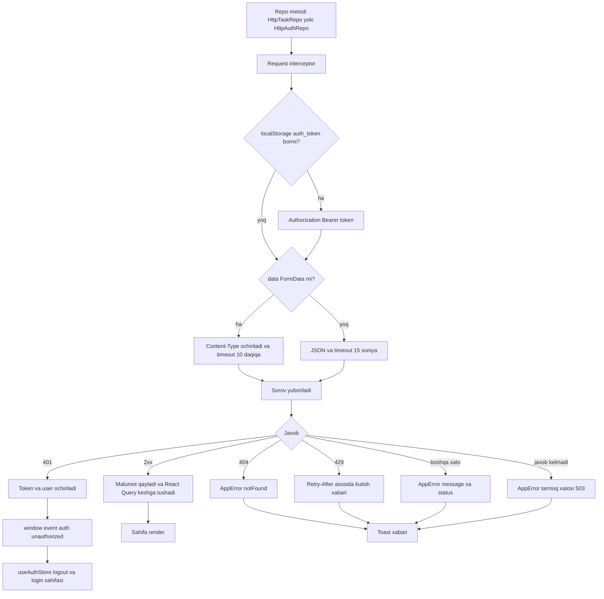

---

## 6. Login oqimi

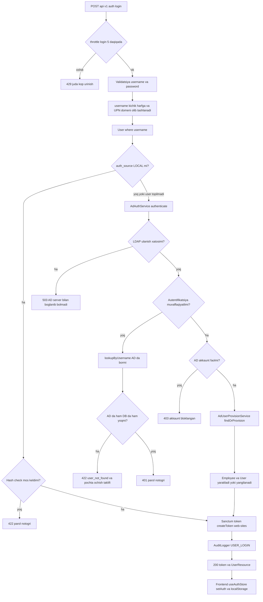

---

## 7. Pochta AD hisobi ochish oqimi

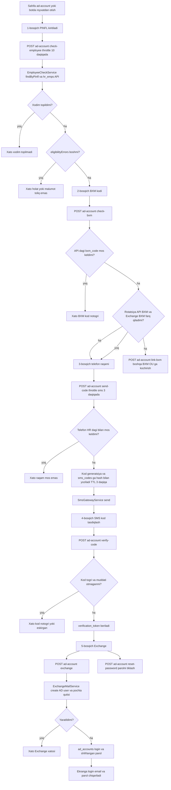

---

## 8. Zayavka yaratish oqimi

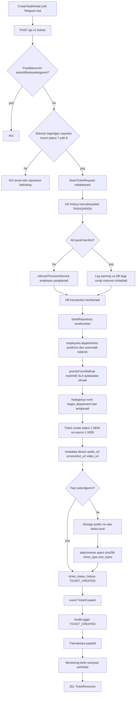

---

## 9. Zayavka hayot sikli

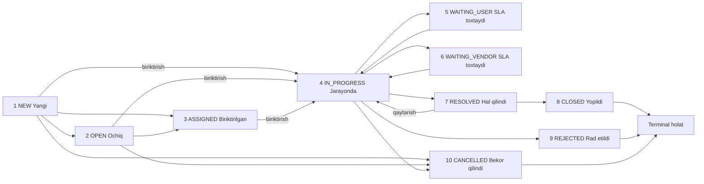

> `status_group`: OPEN — 1, 2, 3 · IN_PROGRESS — 4 · PENDING — 5, 6 va `pauses_sla` ·
> RESOLVED — 7 · CLOSED — 8, 9, 10 va `is_terminal`.
> O'tishlar `ticket_status_transitions` jadvalidan boshqariladi: qator mavjud bo'lsa va
> `is_active = false` bo'lsa o'tish taqiqlanadi; `requires_comment = true` bo'lsa izoh majburiy.

---

## 10. Zayavkani biriktirish oqimi

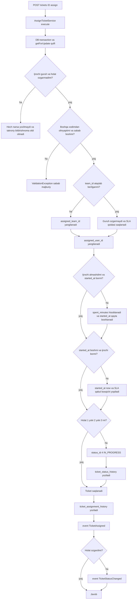

---

## 11. Holatni o'zgartirish oqimi

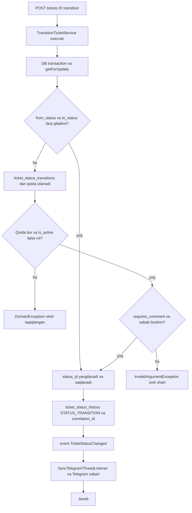

---

## 12. SLA hisoblash oqimi

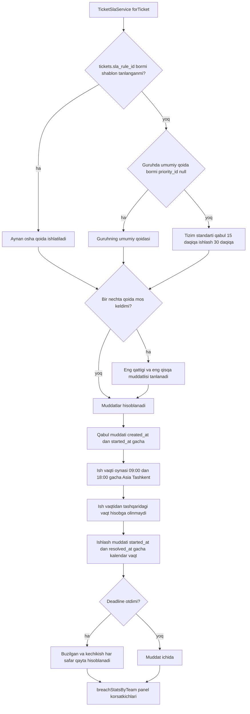

---

## 13. Izoh va biriktirma oqimi

```mermaid
graph TD
  subgraph Izohlar
    A1[POST tickets ID comments] --> A2[AddCommentService]
    A2 --> A3[comments comment_type 1 PUBLIC yoki 2 INTERNAL]
    A3 --> A4[event CommentAdded]
    A4 --> A5[SyncTelegramThreadListener murojaatchiga xabar]
  end

  subgraph Biriktirmalar
    B1[POST attachments upload] --> B2[StoreAttachmentService]
    B2 --> B3{public diskka yozildimi?}
    B3 -- yoq --> B4[local diskka yoziladi]
    B3 -- ha --> B5[storage_disk public]
    B4 --> B6[attachments qatori sha256 mime_type size_bytes]
    B5 --> B6
    B6 --> B7[event AttachmentStored]
  end

  subgraph Yuklab olish IDOR himoyasi
    C1[AttachmentResource 30 daqiqalik imzolangan havola beradi]
    C1 --> C2[GET attachments ID download]
    C2 --> C3{signed relative imzo togrimi?}
    C3 -- yoq --> C4[403]
    C3 -- ha --> C5[Fayl oqimi qaytariladi]
  end
```

---

## 14. Domen hodisalari va tinglovchilar

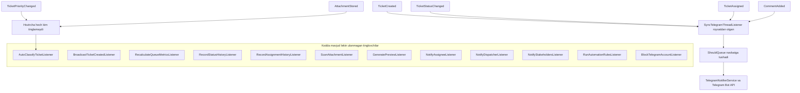

> Eslatma: hozirda faqat `SyncTelegramThreadListener` `AppServiceProvider::boot()` ichida
> `Event::listen` orqali ulangan. Qolgan tinglovchilar fayl sifatida mavjud, lekin
> ro'yxatdan o'tmagan — `bootstrap/app.php` da `withEvents()` yo'q, shuning uchun avtomatik
> topilmaydi. Status va biriktirish tarixi hozircha to'g'ridan-to'g'ri servislar ichida yoziladi.

---

## 15. Telegram webhook oqimi

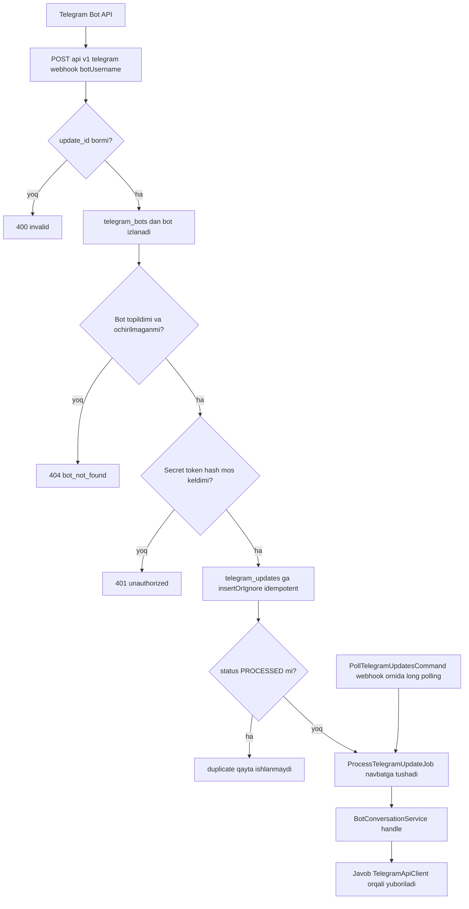

---

## 16. Telegram bot suhbat mashinasi

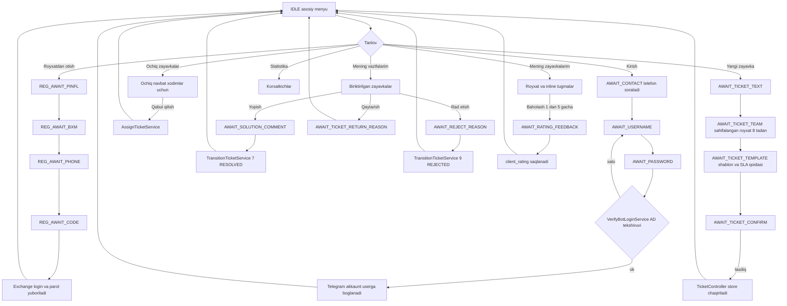

---

## 17. Bildirishnoma oqimi

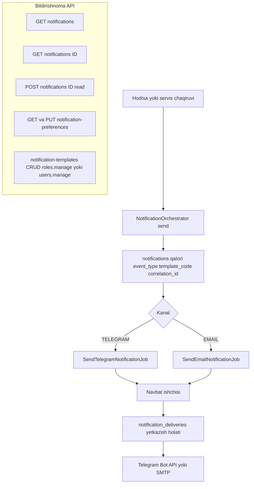

---

## 18. Cisco Finesse qo'ng'iroq oqimi

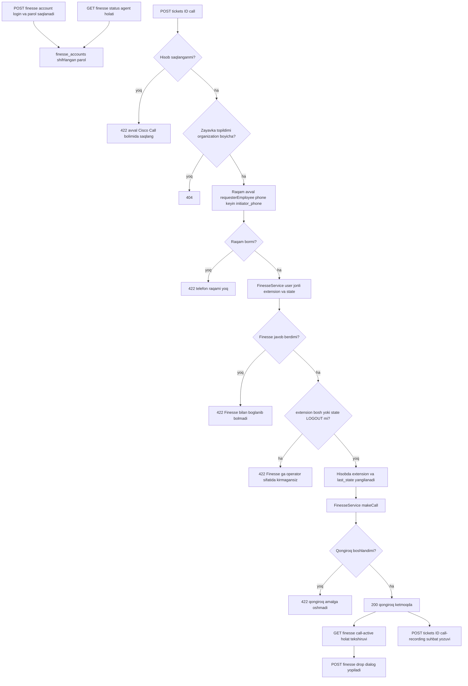

---

## 19. RBAC huquq tekshiruvi

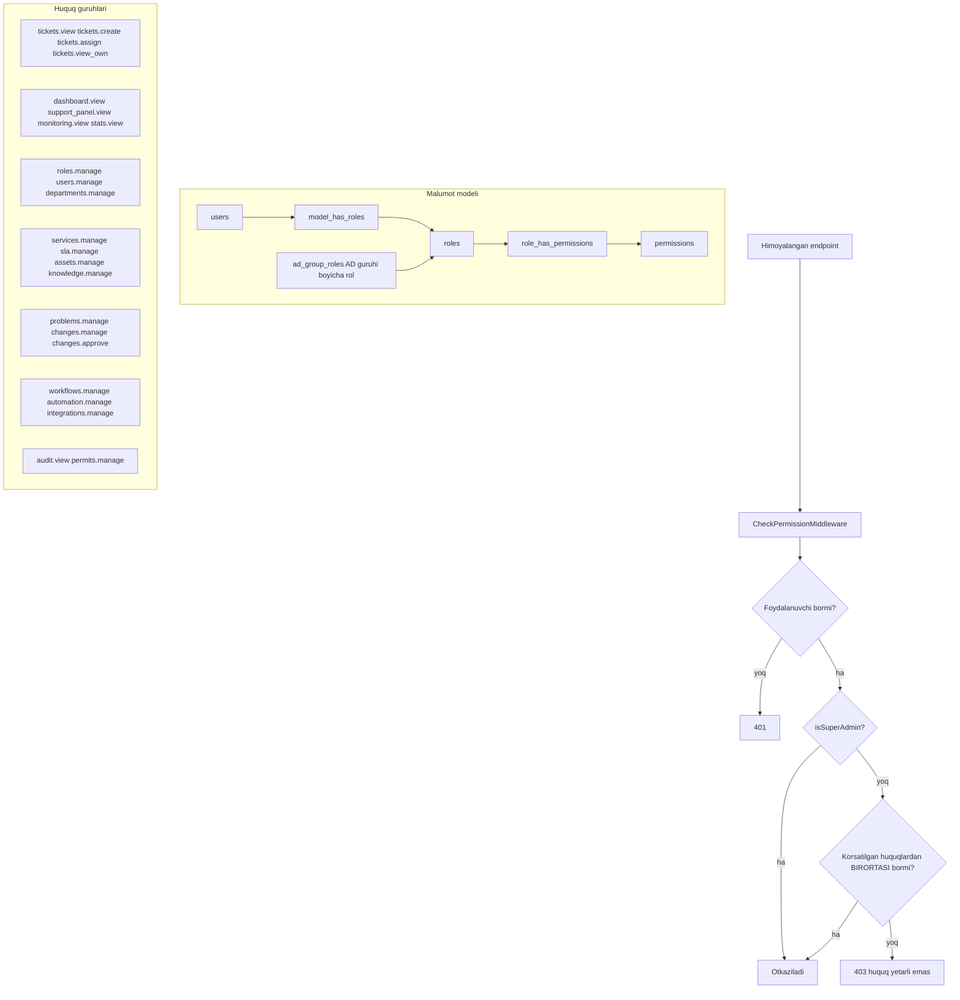

---

## 20. Ma'lumotlar bazasi bloklari

```mermaid
graph TD
  subgraph Reference migratsiya 000010
    R1[ticket_statuses ticket_status_transitions ticket_priorities ticket_sources]
    R2[comment_types comment_sources attachment_types notification_channels]
    R3[asset_types asset_statuses relationship_types article_types]
    R4[locales timezones employment_statuses workflow_entity_types integration_types]
  end

  subgraph Organization va HR 000020
    O1[organizations regions branches departments positions employees]
  end

  subgraph Identity va RBAC 000030 va 000040
    I1[users personal_access_tokens]
    I2[roles permissions role_has_permissions model_has_roles ad_group_roles]
  end

  subgraph ITSM master 000050
    M1[categories services service_offerings locations resolution_codes teams]
  end

  subgraph Ticketing 000060 va 000070
    T1[tickets]
    T2[ticket_status_history ticket_assignment_history]
    T3[comments attachments ticket_templates tags]
  end

  subgraph SLA 000080 va keyingi migratsiyalar
    S1[sla_rules team_id priority_id is_default]
  end

  subgraph Notification 000090
    N1[notifications notification_deliveries notification_templates user_notification_preferences]
  end

  subgraph Asset va CMDB 000100
    C1[assets asset_models manufacturers vendors software_products software_licenses]
  end

  subgraph Knowledge 000110
    K1[knowledge_articles article_feedback]
  end

  subgraph Problem Change Catalog 000120
    P1[problems changes maintenance_windows]
    P2[service_catalog_items service_requests approval_requests approval_steps]
  end

  subgraph Workflow va Automation 000130
    W1[workflows workflow_runs workflow_step_runs]
    W2[automation_rules automation_executions]
  end

  subgraph Integration 000140
    GG1[integrations integration_logs webhook_endpoints outbox]
    GG2[telegram_bots telegram_updates telegram akkauntlari]
  end

  subgraph Audit va Security 000150 va 000160 va 000170
    AA1[audit_logs]
    AA2[RLS siyosatlari va partitsiyalash]
    AA3[Full-text indekslar]
  end

  subgraph Qoshimcha migratsiyalar
    X1[sms_codes hashlangan kod va verification_token]
    X2[ad_accounts login va shifrlangan parol]
    X3[finesse_accounts va permits]
  end

  O1 --> I1
  I1 --> T1
  M1 --> T1
  S1 --> T1
  T1 --> N1
  T1 --> AA1
```

---

## 21. Umumiy end-to-end oqim

```mermaid
graph TD
  START[Xodimda muammo paydo boldi] --> CH{Qaysi kanal?}

  CH -- Veb --> W1[Login AD yoki LOCAL]
  CH -- Telegram --> B1[Botga start va telefon tasdiqlash]

  W1 --> W2{AD hisobi bormi?}
  W2 -- yoq --> W3[ad-account PINFL BXM SMS Exchange]
  W3 --> W1
  W2 -- ha --> W4[Token olinadi va bosh sahifaga yonaltiriladi]

  B1 --> B2{Hisob boglanganmi?}
  B2 -- yoq --> B3[Botdan royxatdan otish yoki login]
  B3 --> B4
  B2 -- ha --> B4[Bot menyusi]

  W4 --> CREATE[Zayavka yaratish]
  B4 --> CREATE

  CREATE --> GUARD{Bahosiz eski zayavka bormi?}
  GUARD -- ha --> RATEOLD[Avval eski zayavkaga baho beriladi]
  RATEOLD --> CREATE
  GUARD -- yoq --> NEW[Ticket status 1 NEW va SLA qabul taymeri boshlanadi]

  NEW --> EVC[event TicketCreated va Telegram xabari]
  EVC --> QUEUE[Navbat tasks sahifasi yoki botdagi ochiq zayavkalar]
  QUEUE --> TAKE[Xodim qabul qiladi]
  TAKE --> ASG[AssignTicketService started_at va status 4]
  ASG --> EVA[event TicketAssigned va event TicketStatusChanged]

  EVA --> WORK[Ish jarayoni izohlar biriktirmalar Finesse qongirogi]
  WORK --> PAUSE{Kutish kerakmi?}
  PAUSE -- ha --> WAIT[5 WAITING_USER yoki 6 WAITING_VENDOR SLA toxtaydi]
  WAIT --> WORK
  PAUSE -- yoq --> RESULT{Natija}

  RESULT -- hal qilindi --> SOLVE[Yechim matni va status 7 RESOLVED]
  RESULT -- rad etildi --> REJECT[Sabab va status 9 REJECTED]
  RESULT -- bekor qilindi --> CANCEL[status 10 CANCELLED]

  SOLVE --> NOTIFY[Murojaatchiga Telegram xabari]
  REJECT --> NOTIFY
  NOTIFY --> RATE[Baholash 1 dan 5 gacha va izoh]
  RATE --> CLOSE[status 8 CLOSED]
  CANCEL --> ARCH

  CLOSE --> ARCH[Arxiv]
  ARCH --> METRICS[Korsatkichlar SLA buzilishi xodim yuklamasi monitoring]
  METRICS --> PANELS[Dashboard Support panel Stats Team workload Audit]
```

---

## Manbalar

| Diagramma | Kod bazasidagi manba |
|---|---|
| Marshrutlar va huquqlar | `backend/routes/api.php`, `backend/app/Http/Middleware/CheckPermissionMiddleware.php` |
| Middleware konveyeri | `backend/bootstrap/app.php` |
| Login | `backend/app/Http/Controllers/Api/AuthController.php`, `backend/app/Services/AdAuthService.php` |
| AD pochta ochish | `backend/app/Http/Controllers/Api/AdAccountController.php`, `backend/app/Services/EmployeeCheckService.php`, `SmsGatewayService.php`, `ExchangeMailService.php` |
| Zayavka yaratish | `backend/app/Modules/Ticketing/Presentation/Http/Controllers/TicketController.php` |
| Biriktirish va holat o'tishi | `backend/app/Modules/Ticketing/Domain/Services/AssignTicketService.php`, `TransitionTicketService.php` |
| SLA | `backend/app/Modules/Ticketing/Domain/Services/TicketSlaService.php` |
| Holatlar ro'yxati | `backend/database/seeders/ReferenceDataSeeder.php` |
| Hodisalar va tinglovchilar | `backend/app/Providers/AppServiceProvider.php`, `backend/app/Modules/Ticketing/Domain/Events/` |
| Telegram | `backend/app/Modules/Telegram/**` |
| Bildirishnoma | `backend/app/Modules/Notification/**` |
| Finesse | `backend/app/Http/Controllers/Api/FinesseController.php`, `backend/app/Services/FinesseService.php` |
| Frontend marshrutlar | `frontend/src/App.tsx` |
| Frontend API qatlami | `frontend/src/shared/infrastructure/http/axiosClient.ts` |
| DB bloklari | `backend/database/migrations/` |
